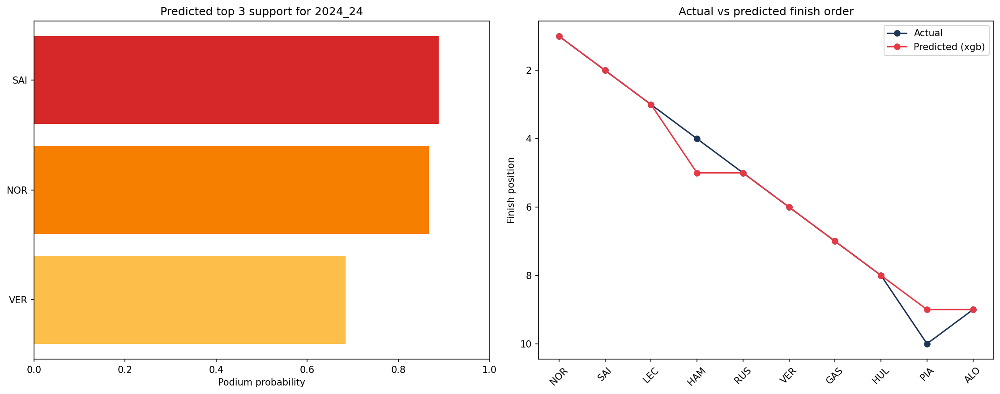
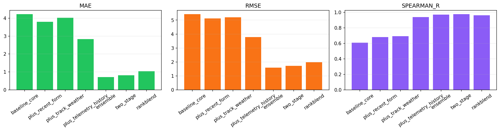
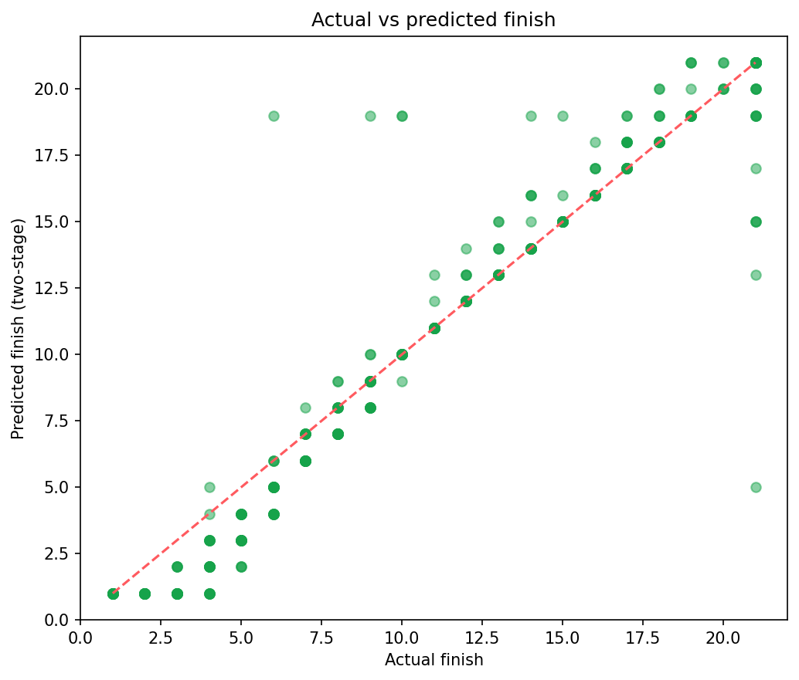
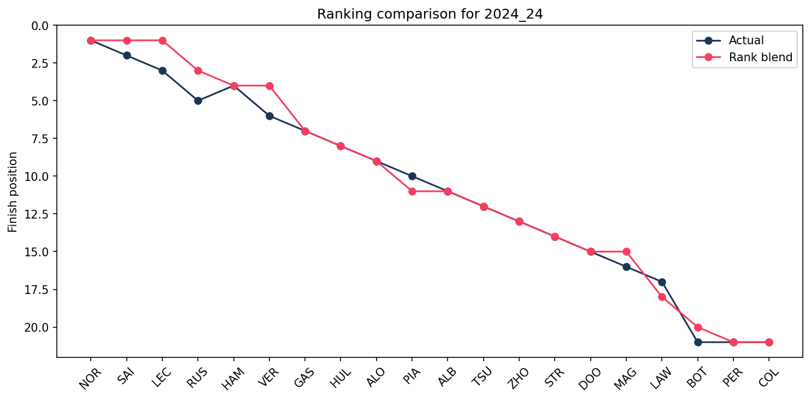

<div align="center">


[](https://python.org)
[](https://xgboost.readthedocs.io)
[](https://streamlit.io)
[](https://shap.readthedocs.io)
[](LICENSE)

> **End-to-end Formula 1 race prediction platform** — engineered features, multi-model comparison, SHAP explainability, and an interactive Streamlit dashboard. Built on real FastF1 race data from 2018–2024.

</div>

---

## 🏆 Results At A Glance

> Best model was off by **less than half a finishing position** on average.

| Model | MAE ↓ | RMSE ↓ | Top-3 Accuracy ↑ | Top-10 Accuracy ↑ | Spearman r ↑ |
|-------|------:|-------:|----------------:|------------------:|-------------:|
| **XGBoost** | **0.4447** | **1.5755** | **98.61%** | 96.25% | 0.9667 |
| Ensemble | 0.7161 | 1.5848 | 98.61% | 96.25% | 0.9706 |
| Two-Stage | 0.8163 | 1.7127 | 98.61% | **97.92%** | **0.9748** |
| Random Forest | 1.0271 | 1.8504 | 94.44% | 95.83% | 0.9539 |

| Metric | Value |
|--------|-------|
| 📦 Dataset | 2,979 driver-race records · 149 races · 2018–2024 |
| 🧪 Test Set | 479 driver-race records across the full 2024 season |
| ⚙️ Features | 78 engineered features |
| 🔍 Leakage Audit | ✅ Passed across all 2,979 rows · 0 violations detected |

---

## 📸 Project Preview

### Race Prediction Dashboard

*Full race prediction dashboard — predicted finishing order, podium probabilities, and model comparison*

### Ablation Study

*MAE improvement from 4.2227 (baseline) → 0.4447 (full XGBoost pipeline) across ablation stages*

### Actual vs Predicted Finish Order

*Two-stage model: predicted vs actual finishing positions across the 2024 test season*

### Ranking Comparison

*Rank-blend comparison — model rankings vs ground truth across the latest race*

---

## 💡 What This Project Does

RaceIQ treats F1 race prediction as both a **regression** and a **ranking** problem — not just "who wins" but where every driver finishes, why, and how confident the model is.

- 🏎️ **Predicts finishing order** for all drivers in a race
- 📊 **Computes probabilities** — podium, points finish, and DNF risk per driver
- 🔍 **Explains every prediction** — SHAP global summaries and per-driver feature contributions
- 📈 **Compares 4 model families** — Ridge, Random Forest, XGBoost, Ensemble, Two-Stage, Rank-Blend
- 🧪 **Validates rigorously** — temporal train/val/test split, leakage audit, ablation analysis

---

## 🖥️ Dashboard Pages

> Accessible via the interactive Streamlit app (`streamlit run app.py`)

### 🏁 Race Prediction View
- Race selector and model selector dropdowns
- Predicted podium with driver probability bars
- Side-by-side model comparison charts
- Per-driver finishing position confidence

### 📡 Telemetry Bay
- Tyre degradation curves across stints
- Strategy timeline overlays
- Speed-trap comparisons between drivers
- Post-race telemetry explainability visuals

### 🧠 Explainability Panel
- SHAP global feature importance summary
- Per-prediction top-10 feature contributions
- Residual analysis across the 2024 season
- Prediction explanation CSV export

---

## 🧠 Tech Stack

### ML / Data
| Tech | Purpose |
|------|---------|
| FastF1 | Raw race data collection (lap times, telemetry, weather) |
| Pandas + NumPy | Feature engineering pipeline |
| Scikit-learn | Ridge, Random Forest, preprocessing pipelines |
| XGBoost | Primary prediction model |
| SHAP | Global + per-prediction explainability |
| Optuna | Hyperparameter optimization |

### Visualization & App
| Tech | Purpose |
|------|---------|
| Streamlit | Interactive race prediction dashboard |
| Plotly | Dynamic charts and race visualizations |
| Matplotlib | Static explainability and ablation plots |

---

## 🏗️ Architecture

```
FastF1 API
    │
    ▼
src/collector.py          ── Raw race-level feature collection
    │
    ▼
src/feature_builder.py    ── 78 engineered features
    │                        (driver form, constructor form, track fit,
    │                         DNF risk, strategy, wet/street scores)
    ▼
src/preprocessor.py       ── Temporal train/val/test split + pipelines
    │
    ▼
src/trainer.py            ── Ridge · RF · XGBoost · Ensemble
    │                        · Rank-Blend · Two-Stage
    ▼
src/evaluator.py          ── Metrics · SHAP artifacts · leakage audit
    │
    ▼
src/explainer.py          ── Telemetry · tyre · strategy · form visuals
    │
    ▼
app.py                    ── Streamlit dashboard
```

---

## ⚙️ Feature Engineering

78 features across 6 categories — built to capture everything that determines a race outcome without leaking future information.

| Category | Features |
|----------|---------|
| 🏎️ Driver Form | Recent finishing positions, points streaks, qualifying delta |
| 🔧 Constructor Form | Team recent results, reliability history, pit stop performance |
| 🏟️ Track Fit | Driver track-specific historical score, circuit type affinity |
| 🌧️ Conditions | Wet performance score, street circuit score, weather sensitivity |
| ⚠️ Reliability | DNF risk score, mechanical failure history, retirement rate |
| 🛞 Strategy | Strategy score, speed-trap history, tyre degradation profile |

### Prediction Strategies
- **Baseline regressors** — Ridge, Random Forest
- **Weighted ensemble** — combined model outputs
- **Two-stage predictor** — classify DNF, then predict finish among finishers
- **Ranking-aware blend** — heuristic post-processing for ranking consistency

### Probability Models
- DNF probability per driver
- Podium probability (top 3 finish)
- Points probability (top 10 finish)

---

## 🚀 Getting Started

### Prerequisites
- Python 3.10+
- pip

### 1. Clone the repo
```bash
git clone https://github.com/ayush-kr-repo/raceiq-f1-intelligence.git
cd raceiq-f1-intelligence
```

### 2. Install dependencies
```bash
pip install -r requirements.txt
```

### 3. Verify the environment
```bash
python scripts/verify_setup.py
# Writes machine-readable report to outputs/verify/setup_report.json
```

### 4. Run with the included dataset
```bash
python run.py --skip-collect
```

### 5. Recollect from FastF1 (optional)
```bash
python run.py --collect-only --seasons 2022
python run.py --collect-only --seasons 2023
python run.py --collect-only --seasons 2024
python run.py --skip-collect
```

### 6. Launch the dashboard
```bash
streamlit run app.py
```
```bash
# Windows shortcut
launch_dashboard.bat
```

---

## 📁 Project Structure

```
raceiq-f1-intelligence/
├── src/
│   ├── collector.py          # FastF1 raw data collection
│   ├── feature_builder.py    # 78-feature engineering pipeline
│   ├── preprocessor.py       # Temporal split + preprocessing
│   ├── trainer.py            # All model training logic
│   ├── evaluator.py          # Metrics, SHAP, leakage audit
│   └── explainer.py          # Telemetry and visual generation
├── app.py                    # Streamlit dashboard entry point
├── run.py                    # End-to-end pipeline runner
├── scripts/
│   └── verify_setup.py       # Environment verification
├── outputs/
│   ├── models/               # Generated model artifacts (local only)
│   ├── plots/                # Race dashboards, ablation, telemetry
│   ├── reports/              # Metrics JSON, predictions CSV, SHAP
│   ├── telemetry/            # Per-race telemetry outputs
│   └── verify/               # Setup verification report
├── requirements.txt
└── launch_dashboard.bat      # Windows dashboard shortcut
```

---

## 🧪 Testing

```bash
# Full test suite
python -m pytest

# Smoke tests only
python -m unittest tests.test_project_smoke

# Environment verification
python scripts/verify_setup.py
```

---

## ⚠️ Current Limitations

- FastF1 session quality varies by race weekend — some sessions require manual skips
- Telemetry comparisons are post-race explainability outputs, not pre-race features
- Ranking-aware logic is heuristic, not a full learning-to-rank model
- Probability calibration uses lightweight sigmoid calibration — rare-event reliability can improve

---

## 🔮 Future Improvements

- Public cloud deployment
- True learn-to-rank model implementation
- Richer telemetry-derived historical features
- Pre-race prediction mode (before qualifying)
- Automated CI pipeline and packaging
- 2025 season live predictions

---

## 📄 License

[](LICENSE)

---

<div align="center">

*Built by [Ayush Kumar](https://github.com/ayush-kr-repo) · [LinkedIn](https://www.linkedin.com/in/ayush-kumar-74a67730a/)*


</div>
